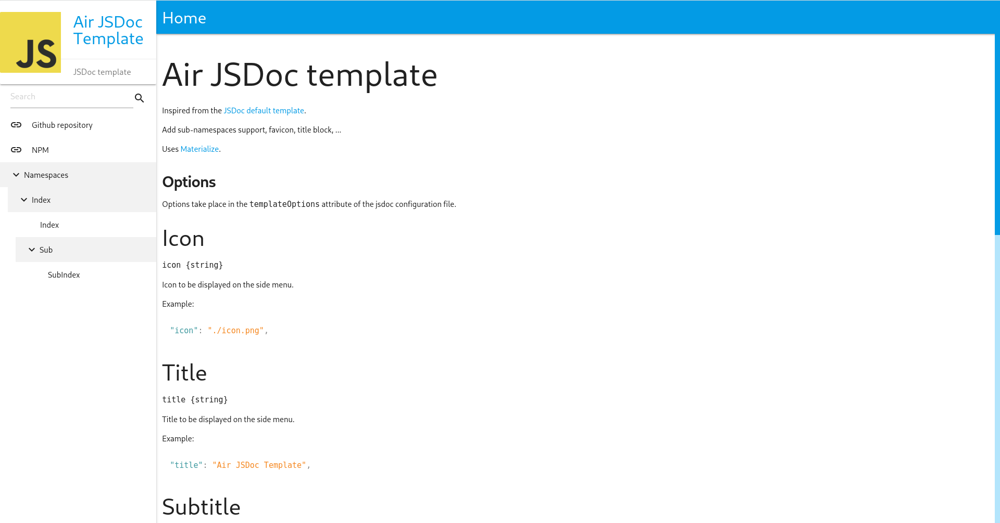

# Air JSDoc template

Inspired from the [JSDoc default template](https://github.com/jsdoc/jsdoc/tree/main/packages/jsdoc/templates/default).

Add sub-namespaces support, search, favicon, title block, code highlight, ...

Uses [Materialize](https://materializecss.com/).



## Options

Options take place in the `templateOptions` attribute of the jsdoc configuration file.

### Icon

`icon {string}`

Icon to be displayed on the side menu.

Example:

```json
"icon": "./icon.png",
```

### Title

`title {string}`

Title to be displayed on the side menu.

Example:

```json
"title": "Air JSDoc Template",
```

### Subtitle

`subTitle {string}`

Subtitle to be displayed on the side menu.

Example:

```json
"subTitle": "JSDoc template",
```

### Favicon

`favicon {string}`

Favicon.

Example:

```json
"favicon": "./icon.png",
```

### Menu

`menu {Array}`

Menu items to append just after the title.

Example:

```json
"menu": [
    {
        "label": "Github repository",
        "link": "https://github.com/Airthium/air-jsdoc-template"
    }
]
```

### Footer

`footer {string}`

Footer.

Example:

```json
"footer": "Copyright © 2021 Airthium"
```
